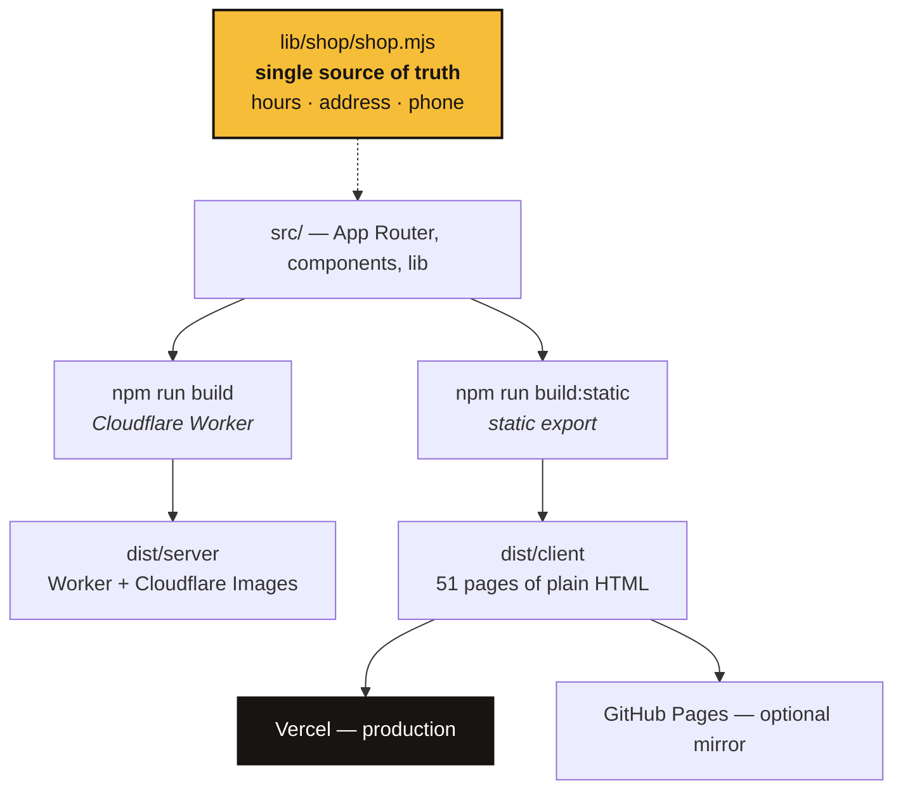
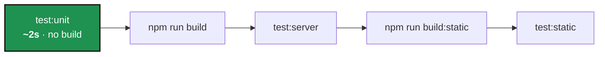
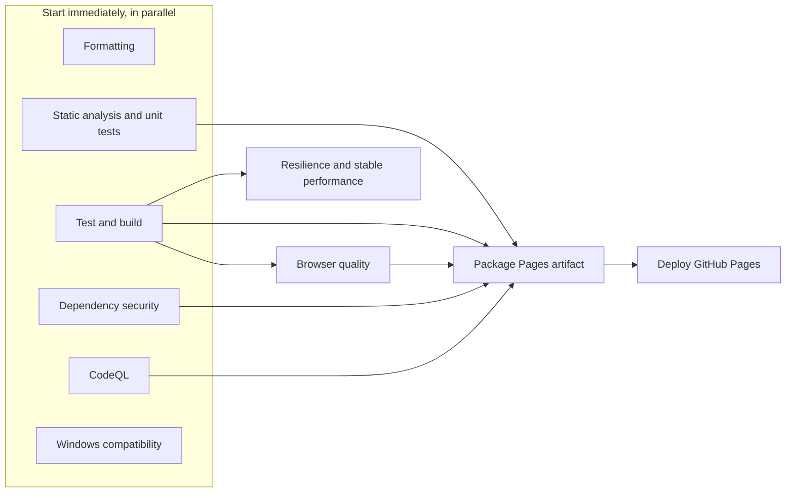

# Ocean Heights Auto & Tire

[](https://github.com/cconway1-stevens/ohat-website/actions/workflows/ci.yml)
[](https://ohat-website.vercel.app/)
[](https://nodejs.org)
[](https://ohat-website.vercel.app/)

The website for a family-run auto repair shop at 1178 Ocean Heights Avenue, Egg
Harbor Township, NJ — built as a retro service-catalog experience, *"Service &
Repair Annual, Issue No. 1178"*, on a modern Next.js stack.

> **The primary conversion on every page is a phone call: (609) 241-1546.**
> Every design and performance decision below serves that one goal.

```mermaid
flowchart LR
  visitor([Visitor]) --> site[Static HTML<br/>pre-rendered, no JS needed to read]
  site --> call[["📞 Call the shop"]]
  site --> directions[Directions]
  site --> hours[Live open/closed sign]
  style call fill:#a8161c,stroke:#171412,stroke-width:3px,color:#fff
```

---

## Contents

1. [Quick start](#quick-start) — get it running in three commands
2. [Hosting](#hosting) — where this actually lives
3. [Architecture](#architecture) — one codebase, two build targets
4. [Testing](#testing) — three tiers, fastest first
5. [CI pipeline](#ci-pipeline) — what gates a merge
6. [Scripts](#scripts) — every command, generated from `package.json`
7. [Site map](#site-map)
8. [Design language](#design-language)
9. [Project structure](#project-structure)
10. [Quality bars](#quality-bars)
11. [Content guardrails](#content-guardrails)

---

## Quick start

Requires **Node.js 24.x**. On Linux also `flock`, `curl`, and GNU `timeout`.

```bash
npm run install:ci   # one bounded lockfile install
npm run dev          # Vite dev server → http://localhost:5173
npm run test:unit    # the whole unit tier, ~2s, no build required
```

That third command is the inner loop — it needs no build artifact, so it is the
fastest honest signal that nothing is broken.

<details>
<summary><strong>Local gotchas worth knowing</strong></summary>

- The dev server simulates Cloudflare bindings via `vite.config.ts`. There is no
  `wrangler.jsonc`.
- Google Fonts cache into `.vinext/fonts/`, which is **gitignored deliberately**:
  the cached CSS bakes in absolute filesystem paths, so a committed cache 404s on
  every machine except the one that generated it. It regenerates on first
  build/dev, falling back to the Google CDN if the network is blocked.
- The remote builder runs `npm run build` against the pushed commit — no need to
  repeat install/build as a routine pre-push step.

</details>

---

## Hosting

Production is **Vercel**, serving the pre-rendered static export. The Cloudflare
Worker build is exercised by CI on every run and is what the app is authored
against; GitHub Pages is an optional mirror of the same static artifact.

<!-- AUTOGEN:hosting START -->
| | Production (Vercel) | Cloudflare Worker | GitHub Pages |
| --- | --- | --- | --- |
| **Status** | Live — the public site | Built and tested every run | Optional mirror |
| **Build command** | `npm run build:static` | `npm run build` | `npm run build:static` |
| **Serves** | `dist/client` — pre-rendered HTML | Worker + Cloudflare Images | `dist/client` |
| **Framework preset** | `none` — this repo owns its build | vinext (Vite + Workers) | none |
| **Config** | [`vercel.json`](vercel.json) | [`src/worker/index.ts`](src/worker/index.ts) | `package-pages` + `deploy` jobs |
<!-- AUTOGEN:hosting END -->

Vercel needs no framework preset (`"framework": null`) because this repo owns its
own build: `npm run build:static` emits a complete, self-contained tree and
Vercel simply serves it. That also means **no Vercel-specific checks are
required** — the artifact CI tests is byte-for-byte the artifact Vercel
publishes, and `dev/tests/static/static-export.test.mjs` asserts `vercel.json`
still points at the build the suite exercises, so the two cannot drift apart.

> **Note on GitHub Pages:** the Pages copy must be served from a **domain root**
> — a custom domain or an `<owner>.github.io` repo. A project subpath
> (`owner.github.io/repo/`) cannot work: vinext's prerenderer ignores `basePath`
> and does not implement `assetPrefix`, so its runtime JS and CSS stay pinned to
> the domain root. The build fails early with that explanation rather than
> publishing a broken site. Canonical URLs still point at
> `oceanheightsautorepair.com`, so a mirror never competes in search results.

---

## Architecture

One source tree compiles to two deployable shapes. Everything a visitor reads is
static HTML; JavaScript only enhances.



**Stack:** [Next.js](https://nextjs.org) App Router on
[vinext](https://github.com/cloudflare/vinext) (Vite + Cloudflare Workers),
Tailwind v4 as a base under a hand-rolled design system in `src/app/styles/`,
Cloudflare Images for `next/image` optimization.

Shop facts — hours, address, phone, closures — live only in
`src/lib/shop/shop.mjs`. The open/closed sign, the notice banner, the chat
answers, and the structured data all read from it. Never duplicate that data.

---

## Testing

Tests are tiered by **what they need**, not by what they cover. The tier
directory *is* the wiring: `npm test` runs `dev/tests/<tier>/*.test.mjs`, so a
file outside a tier is a file nothing runs.

<!-- AUTOGEN:tests START -->
| Tier | Command | Files | Needs a build? | Covers |
| --- | --- | --- | --- | --- |
| `unit` | `npm run test:unit` | 14 | **No** — pure logic only | shop hours, notices, chat answers, arcade, transcripts, suite wiring |
| `server` | `npm run test:server` | 2 | Yes — `npm run build` → `dist/server` | server-rendered HTML, per-service SEO |
| `static` | `npm run test:static` | 2 | Yes — `npm run build:static` → `dist/client` | static export, route discovery and classification |

`npm test` runs all three in order: `npm run test:unit && npm run build && npm run test:server && npm run build:static && npm run test:static`.
<!-- AUTOGEN:tests END -->



The unit tier runs **before** any build, so a broken assertion fails in seconds
rather than after two multi-minute builds. `dev/tests/unit/test-tiers.test.mjs`
guards the arrangement itself: it fails if a test file sits outside a tier, if a
tier has no npm script, or if a tier is empty. That guard exists because six chat
test files once sat in `dev/tests/` for months while the gate ran a
hand-maintained list that never mentioned them.

The canonical testing document is
[`dev/docs/test-program.md`](dev/docs/test-program.md) — the master matrix,
page-discovery rules, and which checks gate a PR versus run on a schedule. Any
change to a `check:*` script's coverage must update it.

---

## CI pipeline

One workflow, [`.github/workflows/ci.yml`](.github/workflows/ci.yml), ordered
cheapest and most decisive first.

<!-- AUTOGEN:ci START -->


| Job | Runs on | Waits for |
| --- | --- | --- |
| **Formatting** | PRs + manual | — |
| **Static analysis and unit tests** | push and PR | — |
| **Test and build** | every push and PR | — |
| **Browser quality** | push and PR | `test-build` |
| **Dependency security** | every push and PR | — |
| **CodeQL** | every push and PR | — |
| **Windows compatibility** | PRs + manual | — |
| **Resilience and stable performance** | weekly + manual | `test-build` |
| **Package Pages artifact** | main only | `static-analysis`, `test-build`, `browser-quality`, `dependency-security`, `codeql` |
| **Deploy GitHub Pages** | main only | `package-pages` |
<!-- AUTOGEN:ci END -->

Two jobs are worth calling out:

- **Static analysis and unit tests** carries the unit tier because that tier
  needs no build — the whole tier costs about two seconds inside a job that was
  already installing dependencies.
- **Windows compatibility** runs the builds and all three test tiers rather than
  lint and typecheck. Biome, ESLint and `tsc` reach the same verdict on either
  OS; what genuinely differs on Windows is shell scripts, path separators, and
  the tests' own path resolution.

To investigate a failure, open the badge, take the newest run, and open the
failed step — each one is named after the check it runs.

---

## Scripts

Generated from `package.json`, so this table cannot drift from what actually
exists.

<!-- AUTOGEN:scripts START -->
**Everyday**

| Command | Runs |
| --- | --- |
| `npm run dev` | `vite` |
| `npm run build` | `bash dev/scripts/build-verified.sh` |
| `npm run build:static` | `node dev/scripts/generate-image-variants.mjs && node dev/scripts/build-static-export.mjs && node dev/scripts/build-static.mjs` |
| `npm run start` | `vinext start` |
| `npm run format` | `biome format --write .` |
| `npm run lint` | `biome lint .` |
| `npm run typecheck` | `tsc --noEmit` |

**Tests**

| Command | Runs |
| --- | --- |
| `npm run test` | `npm run test:unit && npm run build && npm run test:server && npm run build:static && npm run test:static` |
| `npm run test:unit` | `node --test --test-isolation=none "dev/tests/unit/*.test.mjs"` |
| `npm run test:server` | `node --test "dev/tests/server/*.test.mjs"` |
| `npm run test:static` | `node --test "dev/tests/static/*.test.mjs"` |

**Gates and reports**

| Command | Runs |
| --- | --- |
| `npm run check` | `bash dev/scripts/pre-push.sh` |
| `npm run check:all` | `bash dev/scripts/check-all.sh` |
| `npm run report` | `node dev/scripts/run-tests-report.mjs` |
| `npm run readme` | `node dev/scripts/build-readme.mjs` |

**Individual audits**

| Command | Runs |
| --- | --- |
| `npm run check:fix` | `bash dev/scripts/pre-push.sh --fix` |
| `npm run check:assets` | `node dev/scripts/check-assets.mjs` |
| `npm run check:bloat` | `node dev/scripts/check-bloat.mjs` |
| `npm run check:bundle` | `node dev/scripts/check-bundle.mjs` |
| `npm run check:lighthouse` | `node dev/scripts/check-lighthouse.mjs` |
| `npm run check:lighthouse:fast` | `node dev/scripts/check-lighthouse.mjs --fast` |
| `npm run check:a11y` | `node dev/scripts/check-a11y.mjs` |
| `npm run check:deadcode` | `knip` |
| `npm run check:architecture` | `depcruise src dev --config .dependency-cruiser.cjs` |
| `npm run check:pages` | `node dev/scripts/check-pages.mjs` |
| `npm run check:slow-network` | `node dev/scripts/check-slow-network.mjs` |
| `npm run check:memory` | `node dev/scripts/check-memory.mjs` |
<!-- AUTOGEN:scripts END -->

`npm run readme` regenerates the generated blocks in this file;
`dev/tests/unit/readme.test.mjs` fails the unit tier if they are stale.

---

## Site map

| Route | Purpose |
| --- | --- |
| `/` | Catalog-cover homepage: hero, credentials, services, diagnostics, makes, reviews, visit |
| `/services` | The service board — all 14 service categories |
| `/services/[slug]` | Bay-ticket detail page per service (14 pages, data in `lib/services.ts`) |
| `/our-shop` | Family story and shop photo gallery |
| `/reviews` | Review themes plus CARFAX / Yelp / Facebook profiles |
| `/offers` | Current offers and the preserved legacy coupon |
| `/contact` | Call, visit, and after-hours contact options |
| `/vehicle-drop-off` | Secure after-hours key-drop guide |
| `/hours` | Hours & closures — full weekly schedule and posted closures |
| `/links`, `/links/qr` | Link-tree hub for social bios (QR landing is noindex) |
| `/privacy` | Privacy notice (noindex) |
| `/arcade` (+ 15 games) | The Garage Arcade — easter-egg games, all noindex |
| `/agent` | Dev playground for the pixel-crew mascot and chat brain (noindex) |
| `/contact-card.vcf` | Downloadable vCard |
| Legacy redirects | `/auto-repair`, `/contact-us`, `/coupons`, `/oil-changes`, `/tire-rotation`, `/alignments` |

A branded 404 ("Bay 404") handles everything else. `sitemap.xml` and `robots.txt`
are generated from `app/sitemap.ts` and `app/robots.ts` — derived from the pages
actually emitted, so they cannot drift.

---

## Design language

A vintage car-catalog system, *"The Modern Family Garage"*:

- Cream paper surfaces, deep garage red, signal yellow, and gulf blue, with thick
  ink borders and hard offset shadows.
- Georgia serif display headlines with double-rule catalog mastheads; Geist for
  body text.
- Catalog artifacts throughout: cover-sheet hero, bay-numbered service cards,
  proof-of-work tickets, rubber-stamp seals, a brand marquee, an animated
  drive-off footer.
- Every animation respects `prefers-reduced-motion`.

Design tokens live in `:root` in `src/app/styles/base.css` — including the
accessibility tints `--yellow-tint` / `--blue-tint` used on red and blue
surfaces. The stylesheet is split per section under `src/app/styles/` and
re-imported from `src/app/globals.css`.

---

## Project structure

```
src/              Production source
  app/              Routes (App Router), layout, styles, sitemap/robots
  components/       React components by concern
    layout/           site-header, site-footer, notice-banner
    ui/               Shared widgets (site-image, directions, copy, share)
    shop/             Hours status, almanac, service icons
    arcade/           Game components
  lib/              Non-UI logic and data
    shop/             Single source of truth (shop.mjs + re-exports)
    chat/             Local Q&A matcher behind the contact-page widget
    arcade/           Game logic
    services.ts       Service catalog (drives pages + sitemap)
    seo.ts            Metadata builder
  worker/           Cloudflare Worker entry (image optimization + app handler)
public/           Static assets (brand SVGs, shop photos, favicon)
dev/              Tooling — never shipped
  scripts/          Install, build, QA, and README generation
  tests/            unit/ · server/ · static/
  docs/             Playbook, audits, test program
  reports/          Lighthouse snapshots (gitignored)
```

[`dev/docs/project-playbook.md`](dev/docs/project-playbook.md) holds the rebuild
goals, brand story, content inventory, and owner follow-ups.

---

## Quality bars

Maintained deliberately — please keep them green.

| Bar | Standard |
| --- | --- |
| **Accessibility** | Zero axe-core WCAG 2.1 AA violations on every route; skip links, screen-reader annotations on external links, reduced-motion support |
| **SEO** | Per-page titles, descriptions and canonicals; Open Graph + Twitter cards; `LocalBusiness`, `Service`, `BreadcrumbList` JSON-LD |
| **Performance** | Responsive AVIF ladders, ~25 KB phone hero candidate, 6.5 KB AVIF masthead logo, self-hosted fonts, no external images on the homepage |
| **Code health** | No dead files, exports or dependencies (`knip`); no file over its role-based line budget; JS+CSS under the byte budget |
| **Resilience** | Every page loads within budget on throttled slow 3G; no DOM-node or heap growth across repeated navigation |
| **Security** | `npm audit` fails on high/critical; CodeQL scans every push and PR |

Lighthouse reports performance against a 60 reference floor with **80+ as the
goal**; performance is advisory because shared-runner scores vary. The noindex
tier (arcade, agent) has its own floor — those pages ship game code on purpose.

---

## Content guardrails

- Keep the phone number **(609) 241-1546** consistent everywhere.
- Only make claims backed by the playbook's audit records — ASE certification,
  CARFAX Top-Rated, 40+ years of parts experience.
- Symptom answers in the chat brain must **never diagnose**. They mirror the
  customer's words, hedge, and lead with the call chip;
  `dev/tests/unit/chat-legal.test.mjs` enforces the banned-claims list.
- Brand marks in `public/brands/` belong to their owners and are shown as
  representative makes serviced.
